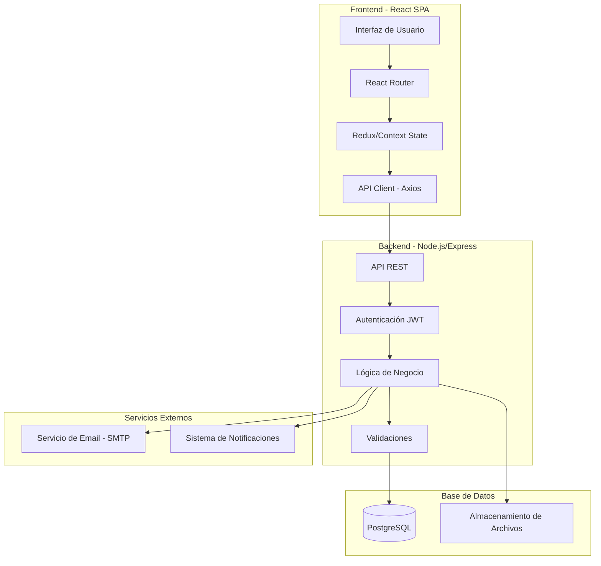
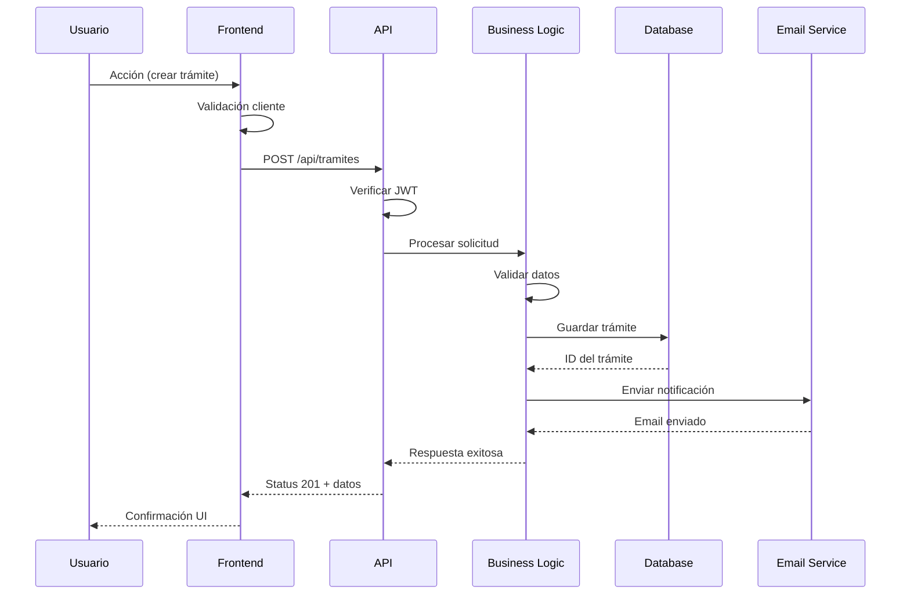
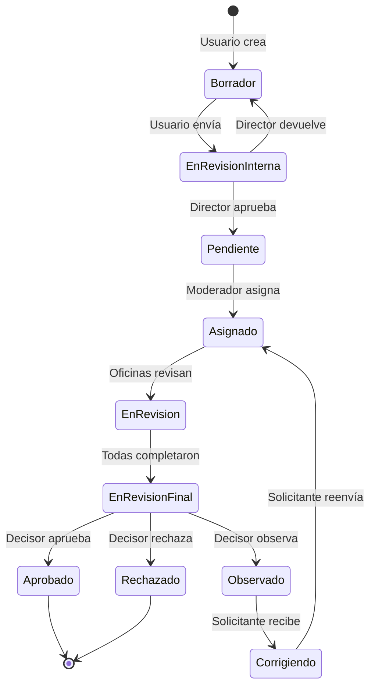

## 1. RESUMEN DEL PROYECTO

### 1.1 Objetivo

Sistema web integral para la gestión de trámites municipales (habilitaciones comerciales, permisos de obras, etc.) que permite a empresas crear y gestionar solicitudes, a oficinas técnicas revisar y evaluar sección por sección, y a jefes decisores tomar decisiones finales fundamentadas.

### 1.2 Alcance

El sistema cubre el ciclo completo de un trámite:
1. **Creación** por usuario solicitante de una empresa
2. **Revisión interna** por director de empresa
3. **Asignación** por moderador del sistema a oficinas evaluadoras
4. **Evaluación técnica** por jefes de oficinas sección por sección
5. **Decisión final** por jefe decisor (aprobar/observar/rechazar)
6. **Ciclo de corrección** si el trámite fue observado
7. **Seguimiento y trazabilidad** completa del proceso

### 1.3 Usuarios del Sistema

| Rol | Descripción | Módulos |
|-----|-------------|---------|
| **Administrador** | Gestiona empresas, usuarios, oficinas, configuración | 1, 4 |
| **Director de Empresa** | Aprueba/rechaza trámites internamente antes de enviarlos | 2 |
| **Usuario Solicitante** | Crea y completa formularios de trámites | 5 |
| **Moderador del Sistema** | Asigna trámites a oficinas y designa decisor | 6 |
| **Jefe de Oficina (Revisor)** | Evalúa secciones técnicas de su área | 7 |
| **Jefe de Oficina (Decisor)** | Toma decisión final del trámite | 8 |

### 1.4 Métricas del Proyecto

- **Total de Historias de Usuario:** 162 HU documentadas
- **Módulos Funcionales:** 8 módulos completos
- **Líneas de Documentación:** ~25,000 líneas
- **Roles de Usuario:** 6 roles diferentes
- **Estados de Trámite:** 12 estados distintos

---

## 2. ARQUITECTURA GENERAL

### 2.1 Diagrama de Arquitectura de Alto Nivel



### 2.2 Flujo de Datos Principal



### 2.3 Estados de un Trámite



### 2.4 Stack Tecnológico

#### Frontend
- **Framework:** React 18+
- **Routing:** React Router v6
- **State Management:** Redux Toolkit + RTK Query
- **UI Components:** Material-UI (MUI) v5
- **Forms:** React Hook Form + Yup
- **HTTP Client:** Axios
- **Build Tool:** Vite

#### Backend
- **Runtime:** Node.js 18+ LTS
- **Framework:** Express.js 4.x
- **ORM:** Sequelize 6.x
- **Authentication:** JWT (jsonwebtoken)
- **Validation:** Joi
- **File Upload:** Multer
- **Email:** Nodemailer

#### Base de Datos
- **DBMS:** PostgreSQL 14+
- **Migrations:** Sequelize CLI
- **File Storage:** Sistema de archivos local o S3

#### DevOps
- **Containerization:** Docker + Docker Compose
- **CI/CD:** GitHub Actions
- **Testing:** Jest + React Testing Library
- **Code Quality:** ESLint + Prettier

---

## 3. ESPECIFICACIÓN DEL BACKEND

### 3.1 Modelos de Datos / Entidades

#### 3.1.1 Usuario (User)

```javascript
{
  id: UUID PRIMARY KEY,
  nombre: STRING(100) NOT NULL,
  apellido: STRING(100) NOT NULL,
  email: STRING(255) UNIQUE NOT NULL,
  password: STRING(255) NOT NULL, // bcrypt hash
  dni: STRING(20) UNIQUE NOT NULL,
  telefono: STRING(50),
  rol: ENUM('admin', 'director', 'solicitante', 'moderador', 'jefe_oficina'),
  estado: ENUM('activo', 'inactivo', 'suspendido') DEFAULT 'activo',
  empresa_id: UUID FOREIGN KEY NULLABLE,
  oficina_id: UUID FOREIGN KEY NULLABLE,
  cargo: STRING(100),
  fecha_creacion: TIMESTAMP DEFAULT NOW(),
  fecha_actualizacion: TIMESTAMP,
  ultimo_acceso: TIMESTAMP,
  
  // Relaciones
  empresa: BELONGS_TO Empresa,
  oficina: BELONGS_TO Oficina,
  tramites_creados: HAS_MANY Tramite,
  evaluaciones: HAS_MANY Evaluacion,
  decisiones: HAS_MANY Decision
}
```

#### 3.1.2 Empresa (Company)

```javascript
{
  id: UUID PRIMARY KEY,
  razon_social: STRING(255) NOT NULL,
  nombre_fantasia: STRING(255),
  cuit: STRING(20) UNIQUE NOT NULL,
  direccion: STRING(255) NOT NULL,
  telefono: STRING(50),
  email: STRING(255) NOT NULL,
  estado: ENUM('activa', 'inactiva', 'suspendida') DEFAULT 'activa',
  fecha_creacion: TIMESTAMP DEFAULT NOW(),
  fecha_actualizacion: TIMESTAMP,
  
  // Relaciones
  director: BELONGS_TO User, // FK director_id
  usuarios: HAS_MANY User,
  tramites: HAS_MANY Tramite
}
```

#### 3.1.3 Oficina (Office)

```javascript
{
  id: UUID PRIMARY KEY,
  nombre: STRING(100) NOT NULL, // "Oficina Técnica"
  descripcion: TEXT,
  codigo: STRING(20) UNIQUE NOT NULL, // "TEC"
  estado: ENUM('activa', 'inactiva') DEFAULT 'activa',
  email: STRING(255),
  permite_decision_final: BOOLEAN DEFAULT false,
  fecha_creacion: TIMESTAMP DEFAULT NOW(),
  
  // Relaciones
  jefes: HAS_MANY User,
  asignaciones: HAS_MANY AsignacionOficina,
  plantillas_mensaje: HAS_MANY PlantillaMensaje
}
```

#### 3.1.4 TipoTramite (ProcedureType)

```javascript
{
  id: UUID PRIMARY KEY,
  nombre: STRING(100) NOT NULL, // "Habilitación Comercial"
  descripcion: TEXT,
  codigo: STRING(20) UNIQUE NOT NULL, // "HAB_COM"
  estado: ENUM('activo', 'inactivo') DEFAULT 'activo',
  estructura_formulario: JSONB NOT NULL, // Define secciones y campos
  plazo_dias: INTEGER,
  requiere_pago: BOOLEAN DEFAULT false,
  monto_tasa: DECIMAL(10,2),
  fecha_creacion: TIMESTAMP DEFAULT NOW(),
  
  // Ejemplo de estructura_formulario:
  // {
  //   secciones: [
  //     {
  //       id: 1,
  //       nombre: "Datos del Solicitante",
  //       campos: [
  //         { nombre: "nombre", tipo: "text", requerido: true },
  //         { nombre: "dni", tipo: "text", requerido: true }
  //       ]
  //     }
  //   ]
  // }
  
  // Relaciones
  tramites: HAS_MANY Tramite
}
```

#### 3.1.5 Tramite (Procedure)

```javascript
{
  id: UUID PRIMARY KEY,
  numero: STRING(20) UNIQUE NOT NULL, // Auto-generado: "00128"
  tipo_tramite_id: UUID FOREIGN KEY NOT NULL,
  empresa_id: UUID FOREIGN KEY NOT NULL,
  solicitante_id: UUID FOREIGN KEY NOT NULL,
  
  // Estados del ciclo de vida
  estado: ENUM(
    'borrador',
    'en_revision_interna',
    'pendiente_asignacion',
    'asignado',
    'en_revision',
    'en_revision_final',
    'aprobado',
    'rechazado',
    'observado',
    'corrigiendo'
  ) DEFAULT 'borrador',
  
  // Datos del formulario (JSONB)
  datos_formulario: JSONB NOT NULL,
  // Ejemplo: { seccion_1: { nombre: "Juan", dni: "12345678" }, seccion_2: {...} }
  
  // Metadatos
  fecha_creacion: TIMESTAMP DEFAULT NOW(),
  fecha_envio_director: TIMESTAMP,
  fecha_aprobacion_director: TIMESTAMP,
  fecha_asignacion: TIMESTAMP,
  fecha_revision_final: TIMESTAMP,
  fecha_decision_final: TIMESTAMP,
  fecha_finalizacion: TIMESTAMP,
  
  // Observaciones del director
  observaciones_director: TEXT,
  aprobado_por_director: BOOLEAN,
  
  // Jefe decisor
  jefe_decisor_id: UUID FOREIGN KEY,
  
  // Relaciones
  tipo_tramite: BELONGS_TO TipoTramite,
  empresa: BELONGS_TO Empresa,
  solicitante: BELONGS_TO User,
  jefe_decisor: BELONGS_TO User,
  archivos: HAS_MANY Archivo,
  asignaciones_oficinas: HAS_MANY AsignacionOficina,
  evaluaciones: HAS_MANY Evaluacion,
  decision_final: HAS_ONE DecisionFinal,
  historial: HAS_MANY HistorialEstado
}
```

#### 3.1.6 Archivo (File)

```javascript
{
  id: UUID PRIMARY KEY,
  tramite_id: UUID FOREIGN KEY NOT NULL,
  seccion_numero: INTEGER NOT NULL, // A qué sección pertenece
  nombre_original: STRING(255) NOT NULL,
  nombre_archivo: STRING(255) NOT NULL, // Nombre único en storage
  ruta: STRING(500) NOT NULL,
  tipo_mime: STRING(100),
  tamano_bytes: BIGINT,
  fecha_subida: TIMESTAMP DEFAULT NOW(),
  subido_por: UUID FOREIGN KEY,
  
  // Relaciones
  tramite: BELONGS_TO Tramite,
  usuario: BELONGS_TO User
}
```

#### 3.1.7 AsignacionOficina (OfficeAssignment)

```javascript
{
  id: UUID PRIMARY KEY,
  tramite_id: UUID FOREIGN KEY NOT NULL,
  oficina_id: UUID FOREIGN KEY NOT NULL,
  jefe_asignado_id: UUID FOREIGN KEY NOT NULL,
  es_decisor: BOOLEAN DEFAULT false, // ★ Marca al decisor
  
  estado: ENUM('pendiente', 'en_revision', 'completada') DEFAULT 'pendiente',
  fecha_asignacion: TIMESTAMP DEFAULT NOW(),
  fecha_inicio_revision: TIMESTAMP,
  fecha_finalizacion: TIMESTAMP,
  
  // Relaciones
  tramite: BELONGS_TO Tramite,
  oficina: BELONGS_TO Oficina,
  jefe_asignado: BELONGS_TO User,
  evaluaciones_secciones: HAS_MANY EvaluacionSeccion
}
```

#### 3.1.8 EvaluacionSeccion (SectionEvaluation)

```javascript
{
  id: UUID PRIMARY KEY,
  asignacion_oficina_id: UUID FOREIGN KEY NOT NULL,
  seccion_numero: INTEGER NOT NULL,
  
  // Resultado de la evaluación
  aprobada: BOOLEAN NOT NULL,
  motivo_rechazo: TEXT, // Requerido si aprobada = false
  
  fecha_evaluacion: TIMESTAMP DEFAULT NOW(),
  evaluado_por: UUID FOREIGN KEY NOT NULL,
  
  // Relaciones
  asignacion_oficina: BELONGS_TO AsignacionOficina,
  evaluador: BELONGS_TO User
}
```

#### 3.1.9 DecisionFinal (FinalDecision)

```javascript
{
  id: UUID PRIMARY KEY,
  tramite_id: UUID FOREIGN KEY NOT NULL UNIQUE,
  jefe_decisor_id: UUID FOREIGN KEY NOT NULL,
  
  // Decisión tomada
  decision: ENUM('aprobado', 'rechazado', 'observado') NOT NULL,
  
  // Si decision = 'observado'
  secciones_a_corregir: JSONB, // Array de números de sección [2, 4]
  
  // Mensaje al solicitante
  mensaje_al_solicitante: TEXT NOT NULL,
  plantilla_usada_id: UUID FOREIGN KEY,
  
  fecha_decision: TIMESTAMP DEFAULT NOW(),
  ip_decisor: STRING(50),
  
  // Relaciones
  tramite: BELONGS_TO Tramite,
  jefe_decisor: BELONGS_TO User,
  plantilla_usada: BELONGS_TO PlantillaMensaje
}
```

#### 3.1.10 PlantillaMensaje (MessageTemplate)

```javascript
{
  id: UUID PRIMARY KEY,
  oficina_id: UUID FOREIGN KEY NOT NULL,
  nombre: STRING(100) NOT NULL,
  tipo_decision: ENUM('aprobado', 'rechazado', 'observado') NOT NULL,
  contenido: TEXT NOT NULL, // Con variables [NOMBRE_SOLICITANTE], etc.
  
  estado: ENUM('activa', 'inactiva') DEFAULT 'activa',
  fecha_creacion: TIMESTAMP DEFAULT NOW(),
  creada_por: UUID FOREIGN KEY,
  
  // Relaciones
  oficina: BELONGS_TO Oficina,
  creador: BELONGS_TO User
}
```

#### 3.1.11 HistorialEstado (StatusHistory)

```javascript
{
  id: UUID PRIMARY KEY,
  tramite_id: UUID FOREIGN KEY NOT NULL,
  estado_anterior: STRING(50),
  estado_nuevo: STRING(50) NOT NULL,
  usuario_id: UUID FOREIGN KEY,
  comentario: TEXT,
  fecha_cambio: TIMESTAMP DEFAULT NOW(),
  metadata: JSONB, // Info adicional del cambio
  
  // Relaciones
  tramite: BELONGS_TO Tramite,
  usuario: BELONGS_TO User
}
```

#### 3.1.12 Notificacion (Notification)

```javascript
{
  id: UUID PRIMARY KEY,
  usuario_id: UUID FOREIGN KEY NOT NULL,
  tramite_id: UUID FOREIGN KEY,
  tipo: ENUM('info', 'warning', 'success', 'error'),
  titulo: STRING(255) NOT NULL,
  mensaje: TEXT NOT NULL,
  leida: BOOLEAN DEFAULT false,
  fecha_creacion: TIMESTAMP DEFAULT NOW(),
  fecha_lectura: TIMESTAMP,
  accion_url: STRING(500), // URL para ir al trámite
  
  // Relaciones
  usuario: BELONGS_TO User,
  tramite: BELONGS_TO Tramite
}
```

### 3.2 Definición de API (Endpoints)

#### 3.2.1 Autenticación

| Método | Endpoint | Descripción | Auth | Request Body | Response |
|--------|----------|-------------|------|--------------|----------|
| POST | `/api/auth/login` | Login de usuario | No | `{ email, password }` | `{ token, user }` |
| POST | `/api/auth/register` | Registro inicial | No | `{ nombre, email, password, ... }` | `{ token, user }` |
| POST | `/api/auth/logout` | Cerrar sesión | Sí | - | `{ message }` |
| GET | `/api/auth/me` | Obtener usuario actual | Sí | - | `{ user }` |
| POST | `/api/auth/refresh` | Refrescar token | Sí | `{ refreshToken }` | `{ token }` |
| POST | `/api/auth/forgot-password` | Recuperar contraseña | No | `{ email }` | `{ message }` |
| POST | `/api/auth/reset-password` | Resetear contraseña | No | `{ token, newPassword }` | `{ message }` |

#### 3.2.2 Usuarios

| Método | Endpoint | Descripción | Roles | Request Body | Response |
|--------|----------|-------------|-------|--------------|----------|
| GET | `/api/users` | Listar usuarios | Admin | Query params: `?rol=&empresa_id=` | `{ users: [], total }` |
| GET | `/api/users/:id` | Obtener usuario | Admin, Self | - | `{ user }` |
| POST | `/api/users` | Crear usuario | Admin | `{ nombre, email, rol, ... }` | `{ user }` |
| PUT | `/api/users/:id` | Actualizar usuario | Admin, Self | `{ nombre, telefono, ... }` | `{ user }` |
| DELETE | `/api/users/:id` | Eliminar usuario | Admin | - | `{ message }` |
| PATCH | `/api/users/:id/estado` | Cambiar estado | Admin | `{ estado: 'activo/inactivo' }` | `{ user }` |

#### 3.2.3 Empresas

| Método | Endpoint | Descripción | Roles | Request Body | Response |
|--------|----------|-------------|-------|--------------|----------|
| GET | `/api/empresas` | Listar empresas | Admin, Moderador | Query: `?estado=&buscar=` | `{ empresas: [], total }` |
| GET | `/api/empresas/:id` | Obtener empresa | Admin, Director, Moderador | - | `{ empresa }` |
| POST | `/api/empresas` | Crear empresa | Admin | `{ razon_social, cuit, ... }` | `{ empresa }` |
| PUT | `/api/empresas/:id` | Actualizar empresa | Admin, Director | `{ razon_social, direccion, ... }` | `{ empresa }` |
| DELETE | `/api/empresas/:id` | Eliminar empresa | Admin | - | `{ message }` |
| GET | `/api/empresas/:id/usuarios` | Usuarios de empresa | Admin, Director | - | `{ usuarios: [] }` |
| GET | `/api/empresas/:id/tramites` | Trámites de empresa | Admin, Director, Moderador | Query: `?estado=` | `{ tramites: [] }` |
| PATCH | `/api/empresas/:id/estado` | Cambiar estado | Admin | `{ estado }` | `{ empresa }` |

#### 3.2.4 Oficinas

| Método | Endpoint | Descripción | Roles | Request Body | Response |
|--------|----------|-------------|-------|--------------|----------|
| GET | `/api/oficinas` | Listar oficinas | Todos autenticados | - | `{ oficinas: [] }` |
| GET | `/api/oficinas/:id` | Obtener oficina | Admin, Moderador | - | `{ oficina }` |
| POST | `/api/oficinas` | Crear oficina | Admin | `{ nombre, codigo, ... }` | `{ oficina }` |
| PUT | `/api/oficinas/:id` | Actualizar oficina | Admin | `{ nombre, descripcion, ... }` | `{ oficina }` |
| DELETE | `/api/oficinas/:id` | Eliminar oficina | Admin | - | `{ message }` |
| GET | `/api/oficinas/:id/jefes` | Jefes de oficina | Admin, Moderador | - | `{ jefes: [] }` |

#### 3.2.5 Tipos de Trámite

| Método | Endpoint | Descripción | Roles | Request Body | Response |
|--------|----------|-------------|-------|--------------|----------|
| GET | `/api/tipos-tramite` | Listar tipos | Todos autenticados | - | `{ tipos: [] }` |
| GET | `/api/tipos-tramite/:id` | Obtener tipo | Todos autenticados | - | `{ tipo }` |
| POST | `/api/tipos-tramite` | Crear tipo | Admin | `{ nombre, codigo, estructura_formulario }` | `{ tipo }` |
| PUT | `/api/tipos-tramite/:id` | Actualizar tipo | Admin | `{ nombre, estructura_formulario, ... }` | `{ tipo }` |
| DELETE | `/api/tipos-tramite/:id` | Eliminar tipo | Admin | - | `{ message }` |

#### 3.2.6 Trámites - CRUD Principal

| Método | Endpoint | Descripción | Roles | Request Body | Response |
|--------|----------|-------------|-------|--------------|----------|
| GET | `/api/tramites` | Listar trámites | Según rol | Query: `?estado=&empresa_id=&tipo=` | `{ tramites: [], total }` |
| GET | `/api/tramites/:id` | Obtener trámite | Owner, Asignados, Admin | - | `{ tramite }` |
| POST | `/api/tramites` | Crear trámite | Solicitante | `{ tipo_tramite_id, datos_formulario }` | `{ tramite }` |
| PUT | `/api/tramites/:id` | Actualizar trámite | Solicitante (si borrador) | `{ datos_formulario }` | `{ tramite }` |
| DELETE | `/api/tramites/:id` | Eliminar trámite | Solicitante (si borrador), Admin | - | `{ message }` |

#### 3.2.7 Trámites - Flujo de Trabajo

| Método | Endpoint | Descripción | Roles | Request Body | Response |
|--------|----------|-------------|-------|--------------|----------|
| POST | `/api/tramites/:id/enviar-director` | Enviar a director | Solicitante | - | `{ tramite }` |
| POST | `/api/tramites/:id/aprobar-director` | Aprobar internamente | Director | - | `{ tramite }` |
| POST | `/api/tramites/:id/rechazar-director` | Rechazar internamente | Director | `{ observaciones }` | `{ tramite }` |
| POST | `/api/tramites/:id/asignar` | Asignar a oficinas | Moderador | `{ oficinas: [{ oficina_id, jefe_id, es_decisor }] }` | `{ tramite, asignaciones }` |
| POST | `/api/tramites/:id/iniciar-revision` | Iniciar revisión | Jefe Oficina | - | `{ tramite }` |
| POST | `/api/tramites/:id/finalizar-revision` | Finalizar revisión | Jefe Oficina | - | `{ tramite }` |
| POST | `/api/tramites/:id/decision-final` | Decisión final | Jefe Decisor | `{ decision, secciones_a_corregir, mensaje }` | `{ tramite, decision }` |
| POST | `/api/tramites/:id/reenviar` | Reenviar corregido | Solicitante | `{ datos_formulario }` | `{ tramite }` |

#### 3.2.8 Archivos

| Método | Endpoint | Descripción | Roles | Request | Response |
|--------|----------|-------------|-------|---------|----------|
| POST | `/api/tramites/:id/archivos` | Subir archivo | Solicitante, Owner | Multipart: `file, seccion_numero` | `{ archivo }` |
| GET | `/api/archivos/:id/download` | Descargar archivo | Authorized | - | File stream |
| DELETE | `/api/archivos/:id` | Eliminar archivo | Owner, Admin | - | `{ message }` |
| GET | `/api/tramites/:id/archivos` | Archivos de trámite | Authorized | - | `{ archivos: [] }` |

#### 3.2.9 Evaluaciones

| Método | Endpoint | Descripción | Roles | Request Body | Response |
|--------|----------|-------------|-------|--------------|----------|
| GET | `/api/tramites/:id/evaluaciones` | Obtener evaluaciones | Asignados, Decisor | - | `{ evaluaciones: [] }` |
| POST | `/api/tramites/:id/evaluaciones/seccion` | Evaluar sección | Jefe Oficina | `{ seccion_numero, aprobada, motivo_rechazo }` | `{ evaluacion }` |
| PUT | `/api/evaluaciones/:id` | Actualizar evaluación | Jefe Oficina (owner) | `{ aprobada, motivo_rechazo }` | `{ evaluacion }` |
| GET | `/api/asignaciones/:id/progreso` | Ver progreso | Jefe Oficina | - | `{ completadas, total, porcentaje }` |

#### 3.2.10 Decisiones Finales

| Método | Endpoint | Descripción | Roles | Request Body | Response |
|--------|----------|-------------|-------|--------------|----------|
| GET | `/api/decisiones/pendientes` | Trámites para decisión | Jefe Decisor | Query: `?antiguedad=&complejidad=` | `{ tramites: [] }` |
| GET | `/api/decisiones/historial` | Historial de decisiones | Jefe Decisor | Query: `?decision=&fecha=` | `{ decisiones: [] }` |
| GET | `/api/decisiones/:id` | Detalle de decisión | Jefe Decisor | - | `{ decision }` |
| GET | `/api/decisiones/:id/seguimiento` | Seguimiento si observado | Jefe Decisor | - | `{ seguimiento }` |

#### 3.2.11 Plantillas de Mensaje

| Método | Endpoint | Descripción | Roles | Request Body | Response |
|--------|----------|-------------|-------|--------------|----------|
| GET | `/api/plantillas-mensaje` | Listar plantillas | Jefe Oficina | Query: `?tipo_decision=` | `{ plantillas: [] }` |
| GET | `/api/plantillas-mensaje/:id` | Obtener plantilla | Jefe Oficina | - | `{ plantilla }` |
| POST | `/api/plantillas-mensaje` | Crear plantilla | Admin, Jefe Oficina | `{ nombre, tipo_decision, contenido }` | `{ plantilla }` |
| PUT | `/api/plantillas-mensaje/:id` | Actualizar plantilla | Admin, Owner | `{ nombre, contenido }` | `{ plantilla }` |
| DELETE | `/api/plantillas-mensaje/:id` | Eliminar plantilla | Admin, Owner | - | `{ message }` |

#### 3.2.12 Notificaciones

| Método | Endpoint | Descripción | Roles | Request | Response |
|--------|----------|-------------|-------|---------|----------|
| GET | `/api/notificaciones` | Mis notificaciones | Authenticated | Query: `?leida=&tipo=` | `{ notificaciones: [], no_leidas }` |
| PATCH | `/api/notificaciones/:id/leer` | Marcar como leída | Owner | - | `{ notificacion }` |
| PATCH | `/api/notificaciones/leer-todas` | Marcar todas leídas | Authenticated | - | `{ message }` |
| DELETE | `/api/notificaciones/:id` | Eliminar notificación | Owner | - | `{ message }` |

#### 3.2.13 Reportes y Estadísticas

| Método | Endpoint | Descripción | Roles | Query Params | Response |
|--------|----------|-------------|-------|--------------|----------|
| GET | `/api/reportes/dashboard` | Dashboard general | Admin, Moderador | - | `{ stats }` |
| GET | `/api/reportes/tramites-por-estado` | Trámites por estado | Admin, Moderador | `?fecha_desde=&fecha_hasta=` | `{ data }` |
| GET | `/api/reportes/desempeno-oficinas` | Desempeño oficinas | Admin | `?periodo=` | `{ oficinas: [] }` |
| GET | `/api/reportes/desempeno-decisor` | Mis métricas decisor | Jefe Decisor | - | `{ metricas }` |
| GET | `/api/reportes/empresa/:id` | Reporte de empresa | Admin, Director | `?periodo=` | `{ reporte }` |

### 3.3 Lógica de Negocio Crítica

#### 3.3.1 Validaciones Esenciales

```javascript
// Validación de Estado de Trámite
function validarCambioEstado(estadoActual, estadoNuevo) {
  const transicionesPermitidas = {
    'borrador': ['en_revision_interna'],
    'en_revision_interna': ['borrador', 'pendiente_asignacion'],
    'pendiente_asignacion': ['asignado'],
    'asignado': ['en_revision'],
    'en_revision': ['en_revision_final'],
    'en_revision_final': ['aprobado', 'rechazado', 'observado'],
    'observado': ['corrigiendo'],
    'corrigiendo': ['asignado']
  };
  
  return transicionesPermitidas[estadoActual]?.includes(estadoNuevo);
}

// Validación de Permisos por Rol
function puedeAccederTramite(usuario, tramite) {
  if (usuario.rol === 'admin') return true;
  if (usuario.rol === 'moderador') return true;
  if (usuario.empresa_id === tramite.empresa_id) return true;
  
  const asignacion = tramite.asignaciones_oficinas.find(
    a => a.jefe_asignado_id === usuario.id
  );
  
  return !!asignacion;
}

// Validación de Evaluación Completa
function evaluacionCompleta(asignacion) {
  const totalSecciones = asignacion.tramite.tipo_tramite.estructura_formulario.secciones.length;
  const seccionesEvaluadas = asignacion.evaluaciones_secciones.length;
  
  return seccionesEvaluadas === totalSecciones;
}

// Validación de Todas las Oficinas Completaron
function todasOficinasCompletaron(tramite) {
  return tramite.asignaciones_oficinas.every(
    asignacion => asignacion.estado === 'completada'
  );
}
```

#### 3.3.2 Generación Automática de Número de Trámite

```javascript
async function generarNumeroTramite() {
  // Formato: año + secuencial de 5 dígitos
  // Ejemplo: 2026-00128
  
  const año = new Date().getFullYear();
  const ultimoTramite = await Tramite.findOne({
    where: sequelize.where(
      sequelize.fn('YEAR', sequelize.col('fecha_creacion')),
      año
    ),
    order: [['numero', 'DESC']]
  });
  
  let secuencial = 1;
  if (ultimoTramite) {
    const partes = ultimoTramite.numero.split('-');
    secuencial = parseInt(partes[1]) + 1;
  }
  
  return `${año}-${secuencial.toString().padStart(5, '0')}`;
}
```

#### 3.3.3 Auto-generación de [DETALLE_OBSERVACIONES]

```javascript
function generarDetalleObservaciones(tramite, seccionesACorregir) {
  let detalle = '';
  
  seccionesACorregir.forEach(numeroSeccion => {
    const seccion = tramite.tipo_tramite.estructura_formulario.secciones
      .find(s => s.id === numeroSeccion);
    
    detalle += `\nSECCIÓN ${numeroSeccion}: ${seccion.nombre.toUpperCase()}\n`;
    
    // Obtener todos los motivos de rechazo de esta sección
    const evaluaciones = tramite.asignaciones_oficinas
      .flatMap(asig => asig.evaluaciones_secciones)
      .filter(eval => eval.seccion_numero === numeroSeccion && !eval.aprobada);
    
    evaluaciones.forEach(eval => {
      detalle += `• ${eval.motivo_rechazo}\n`;
    });
  });
  
  return detalle;
}
```

#### 3.3.4 Reemplazo de Variables en Plantillas

```javascript
function reemplazarVariables(plantilla, datos) {
  const variables = {
    '[NOMBRE_SOLICITANTE]': datos.solicitante.nombre + ' ' + datos.solicitante.apellido,
    '[NUMERO_TRAMITE]': datos.tramite.numero,
    '[TIPO_TRAMITE]': datos.tramite.tipo_tramite.nombre,
    '[EMPRESA]': datos.tramite.empresa.razon_social,
    '[NOMBRE_JEFE]': datos.jefe.nombre + ' ' + datos.jefe.apellido,
    '[NOMBRE_OFICINA]': datos.oficina.nombre,
    '[FECHA]': new Date().toLocaleDateString('es-AR'),
    '[DETALLE_OBSERVACIONES]': datos.detalle_observaciones || ''
  };
  
  let mensaje = plantilla;
  Object.entries(variables).forEach(([variable, valor]) => {
    mensaje = mensaje.replace(new RegExp(variable, 'g'), valor);
  });
  
  return mensaje;
}
```

#### 3.3.5 Sistema de Notificaciones

```javascript
async function enviarNotificaciones(tramite, evento) {
  const notificaciones = [];
  
  switch(evento) {
    case 'decision_final':
      // Al solicitante
      notificaciones.push({
        usuario_id: tramite.solicitante_id,
        tipo: tramite.estado === 'aprobado' ? 'success' : 'warning',
        titulo: `Decisión sobre trámite ${tramite.numero}`,
        mensaje: `Tu trámite ha sido ${tramite.estado}`,
        accion_url: `/tramites/${tramite.id}`
      });
      
      // Al director
      notificaciones.push({
        usuario_id: tramite.empresa.director_id,
        tipo: 'info',
        titulo: `Decisión sobre trámite ${tramite.numero}`,
        mensaje: `El trámite de tu empresa ha sido ${tramite.estado}`,
        accion_url: `/tramites/${tramite.id}`
      });
      break;
      
    case 'asignacion_oficina':
      tramite.asignaciones_oficinas.forEach(asig => {
        notificaciones.push({
          usuario_id: asig.jefe_asignado_id,
          tipo: 'info',
          titulo: 'Nuevo trámite asignado',
          mensaje: `Se te asignó el trámite ${tramite.numero}`,
          accion_url: `/tramites/${tramite.id}`
        });
      });
      break;
  }
  
  await Notificacion.bulkCreate(notificaciones);
  
  // Enviar emails
  notificaciones.forEach(async notif => {
    const usuario = await User.findByPk(notif.usuario_id);
    await enviarEmail(usuario.email, notif.titulo, notif.mensaje);
  });
}
```

#### 3.3.6 Control de Concurrencia

```javascript
// Evitar evaluaciones simultáneas de la misma sección
async function evaluarSeccionConLock(asignacionId, seccionNumero, datos) {
  const transaction = await sequelize.transaction({
    isolationLevel: Transaction.ISOLATION_LEVELS.SERIALIZABLE
  });
  
  try {
    // Verificar que no existe evaluación previa
    const evaluacionExistente = await EvaluacionSeccion.findOne({
      where: {
        asignacion_oficina_id: asignacionId,
        seccion_numero: seccionNumero
      },
      transaction,
      lock: true
    });
    
    if (evaluacionExistente) {
      throw new Error('Esta sección ya fue evaluada');
    }
    
    // Crear evaluación
    const evaluacion = await EvaluacionSeccion.create({
      asignacion_oficina_id: asignacionId,
      seccion_numero: seccionNumero,
      ...datos
    }, { transaction });
    
    await transaction.commit();
    return evaluacion;
    
  } catch (error) {
    await transaction.rollback();
    throw error;
  }
}
```

#### 3.3.7 Cálculo de Métricas de Decisor

```javascript
async function calcularMetricasDecisor(jefeId) {
  const decisiones = await DecisionFinal.findAll({
    where: { jefe_decisor_id: jefeId },
    include: [{ model: Tramite }]
  });
  
  const total = decisiones.length;
  const aprobados = decisiones.filter(d => d.decision === 'aprobado').length;
  const observados = decisiones.filter(d => d.decision === 'observado').length;
  const rechazados = decisiones.filter(d => d.decision === 'rechazado').length;
  
  // Tasa de aprobación
  const tasaAprobacion = (aprobados / total * 100).toFixed(1);
  
  // Tiempo promedio de decisión
  const tiemposDecision = decisiones.map(d => {
    const llegada = new Date(d.tramite.fecha_revision_final);
    const decision = new Date(d.fecha_decision);
    return (decision - llegada) / (1000 * 60 * 60); // horas
  });
  
  const tiempoPromedio = (
    tiemposDecision.reduce((a, b) => a + b, 0) / tiemposDecision.length
  ).toFixed(1);
  
  // Trámites observados que se aprobaron después
  const observadosAprobados = await Tramite.count({
    include: [{
      model: DecisionFinal,
      where: {
        jefe_decisor_id: jefeId,
        decision: 'observado'
      }
    }],
    where: { estado: 'aprobado' }
  });
  
  const tasaExitoCorrecciones = observados > 0 
    ? (observadosAprobados / observados * 100).toFixed(1)
    : 0;
  
  return {
    total,
    aprobados,
    observados,
    rechazados,
    tasaAprobacion,
    tiempoPromedioHoras: tiempoPromedio,
    tasaExitoCorrecciones
  };
}
```
